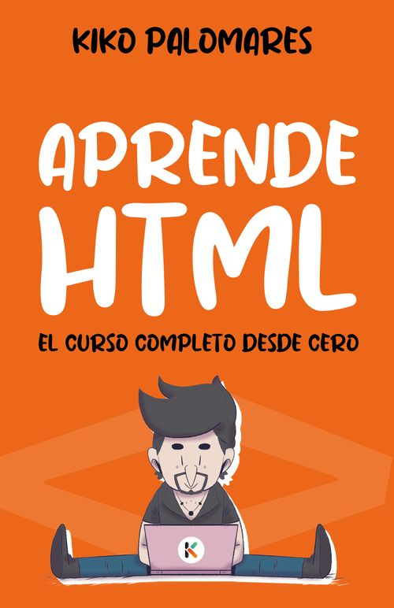

# Curso de HTML completo desde cero

Si quieres aprender a crear páginas web, entonces necesitas aprender HTML. Este curso te enseñará todo lo que necesitas saber sobre HTML.

### ¡Si te resulta útil el curso apoya mi contenido pulsando la *★ Star* del repositorio!

Si tienes dudas mientras haces el curso o te quedas bloqueado puedes preguntar en nuestra comunidad de [discord](http://kikopalomares.com/discord) e intentaremos ayudarte.

----

[Hacer el curso en vídeo](https://kikopalomares.com/cursos/html)

-----------

## El libro del curso

Puedes adquirir el libro del curso en formato papel o digital. Puedes buscarlo directamente en tu tienda Amazon habitual. El contenido del libro es muy similar al que encontrarás en este proyecto, no te hace falta para aprender HTML, adquirir el libro es más un gesto de agradecimiento hacia mi trabajo. Gracias.

- [Ver en Amazon ES](https://amzn.to/3XhpZnK)
- [Ver en Amazon US](https://www.amazon.com/-/es/dp/B0BRLW4XBT)

-----------

## Índice del curso

1. HTML básico
    1. [Introducción a HTML](./modulos/01_HTML_básico/1.1_Introduccion_a_HTML.md)
    2. [Ejemplos básicos](./modulos/01_HTML_básico/1.2_Ejemplos_basicos.md)
    3. [Elementos](./modulos/01_HTML_básico/1.3_Elementos.md)
    4. [Atributos](./modulos/01_HTML_básico/1.4_Atributos.md)
    5. [Encabezados](./modulos/01_HTML_básico/1.5_Encabezados.md)
    6. [Párrafos](./modulos/01_HTML_básico/1.6_Parrafos.md)
    7. [Formato de texto](./modulos/01_HTML_básico/1.7_Formato_de_texto.md)
    8. [Comentarios](./modulos/01_HTML_básico/1.8_Comentarios.md)
    9. [Enlaces](./modulos/01_HTML_básico/1.9_Enlaces.md)
    10. [Imágenes](./modulos/01_HTML_básico/1.10_Imagenes.md)
    11. [Tablas](./modulos/01_HTML_básico/1.11_Tablas.md)
    12. [Listas](./modulos/01_HTML_básico/1.12_Listas.md)
2. Formularios
   1. [Introducción a los formularios](./modulos/02_Formularios/2.1_Formularios.md)
   2. [Elementos de formularios](./modulos/02_Formularios/2.2_Elementos_de_formulario.md)
   3. [Tipos de input](./modulos/02_Formularios/2.3_Tipos_de_input.md)
   4. [Atributos de input](./modulos/02_Formularios/2.4_Atributos_de_input.md)
3. Media en HTML
   1. [Vídeo](./modulos/03_Media_en_HTML/3.1_video.md)
   2. [Audio](./modulos/03_Media_en_HTML/3.2_audio.md)
   3. [YouTube](./modulos/03_Media_en_HTML/3.3_youtube.md)
4. HTML avanzado
   1. [Citas y menciones](./modulos/04_HTML_avanzado/4.1_Citas_y_menciones.md)
   2. [Mapas de imagen](./modulos/04_HTML_avanzado/4.2_Mapas_de_imagen.md)
   3. [El elemento picture](./modulos/04_HTML_avanzado/4.3_Elemento_picture.md)
   4. [Bloques y elementos in línea](./modulos/04_HTML_avanzado/4.4_Bloques_y_elementos_en_linea.md)
   5. [Iframes](./modulos/04_HTML_avanzado/4.5_Iframes.md)
   6. [Head](./modulos/04_HTML_avanzado/4.6_Head.md)
   7. [Layouts](./modulos/04_HTML_avanzado/4.7_Layouts.md)
   8. [Elementos de código](./modulos/04_HTML_avanzado/4.8_Elementos_de_codigo.md)
   9. [Semántica](./modulos/04_HTML_avanzado/4.9_Semantica.md)
   10. [Entidades](./modulos/04_HTML_avanzado/4.10_Entidades.md)
   11. [Emojis](./modulos/04_HTML_avanzado/4.11_Emojis.md)
   12. [Guía de estilo](./modulos/04_HTML_avanzado/4.12_Guia_de_estilo.md)

-----------

### Enlaces de interés

- [Contenido del curso en kikopalomares.com](https://kikopalomares.com/cursos/html)
- [Más contenido de HTML en YouTube](https://www.youtube.com/playlist?list=PLnunbwZjHqMOFL0vGRg-2OhV8fTtbujrD)
- [Documentación de HTML en Mozilla](https://developer.mozilla.org/es/docs/Web/HTML)
- [Documentación de HTML en W3schools](https://www.w3schools.com/html/)

------------

## 👋 Hola, mi nombre es Kiko Palomares

Soy fullstack developer desde hace más de 10 años, autor del libro [*No todo es programar*](https://notodoesprogramar.com/), trabajo como líder de equipo en una empresa y también me dedico a divulgar contenido sobre programación y tecnología en la red. Puedes seguir todo mi contenido desde mi página web [https://kikopalomares.com/](https://kikopalomares.com/) o mis redes sociales como [@kikopalomares](https://kiko.pro/).

Puedes apoyar mi trabajo nominándome como [GitHub Star](https://stars.github.com/nominate/) o marcando la *★ Star* del repositorio.

-----

-----

