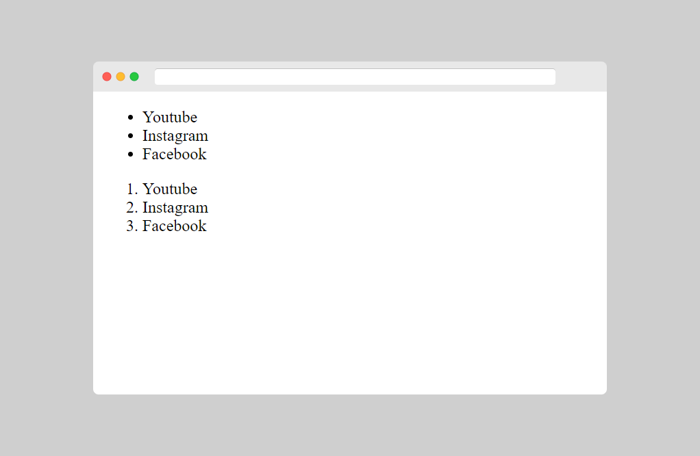

[⏴ Volver al índice](../../README.md#índice-del-curso)

# Ejemplos básicos en HTML

[Ver la clase en vídeo](https://kikopalomares.com/clases/que-es-html-ejemplos-practicos-basicos)

_____

## Documentos HTML
Todos los documentos HTML deben comenzar con una declaración de tipo de documento: `<!DOCTYPE html>`. El documento HTML en sí comienza con `<html>` y termina con `</html>`.

La parte visible del documento HTML está entre `<body>` y `</body>`.

## Cabeceras HTML
Las cabeceras o encabezados HTML se definen con las etiquetas `<h1>` a `<h6>`.

`<h1>` define el encabezado más importante. `<h6>` define el  menos importante

    <h1>Encabezado 1</h1>
    <h2>Encabezado 2</h2>
    <h3>Encabezado 3</h3>

[Archivo del ejemplo](../../ejemplos/1.2_ejemplo_1.html)

## Párrafos HTML
Los párrafos HTML se definen con la etiqueta `
`

    
Esto es un párrafo.

    
Esto es otro párrafo.

[Archivo del ejemplo](../../ejemplos/1.2_ejemplo_2.html)

## Enlaces HTML
Los enlaces HTML se definen con la etiqueta `<a>`.

El destino del enlace se especifica en el atributo href.

Los atributos se utilizan para proporcionar información adicional sobre elementos HTML.

    <a href="https://kikopalomares.com">Esto es un enlace</a>

[Archivo del ejemplo](../../ejemplos/1.2_ejemplo_3.html)

## Imágenes HTML
Las imágenes HTML se definen con la etiqueta ``.

El archivo fuente (src), el texto alternativo (alt), el ancho (width) y el alto (height) se proporcionan como atributos.

    

[Archivo del ejemplo](../../ejemplos/1.2_ejemplo_4.html)

## Botones HTML
Los botones HTML se definen con la etiqueta `<button>`

    <button>Haz click aquí</button>

[Archivo del ejemplo](../../ejemplos/1.2_ejemplo_5.html)

## Listas HTML
Las listas HTML se definen con la etiqueta `<ul>` (lista desordenada / con puntos) o `<ol>` (lista ordenada / numerada), seguidas de etiquetas `<li>` (elementos de la lista)

    <ul>
        <li>Youtube</li>
        <li>Instagram</li>
        <li>Facebook</li>
    </ul>

    <ol>
        <li>Youtube</li>
        <li>Instagram</li>
        <li>Facebook</li>
    </ol>

[Archivo del ejemplo](../../ejemplos/1.2_ejemplo_6.html)

------------
