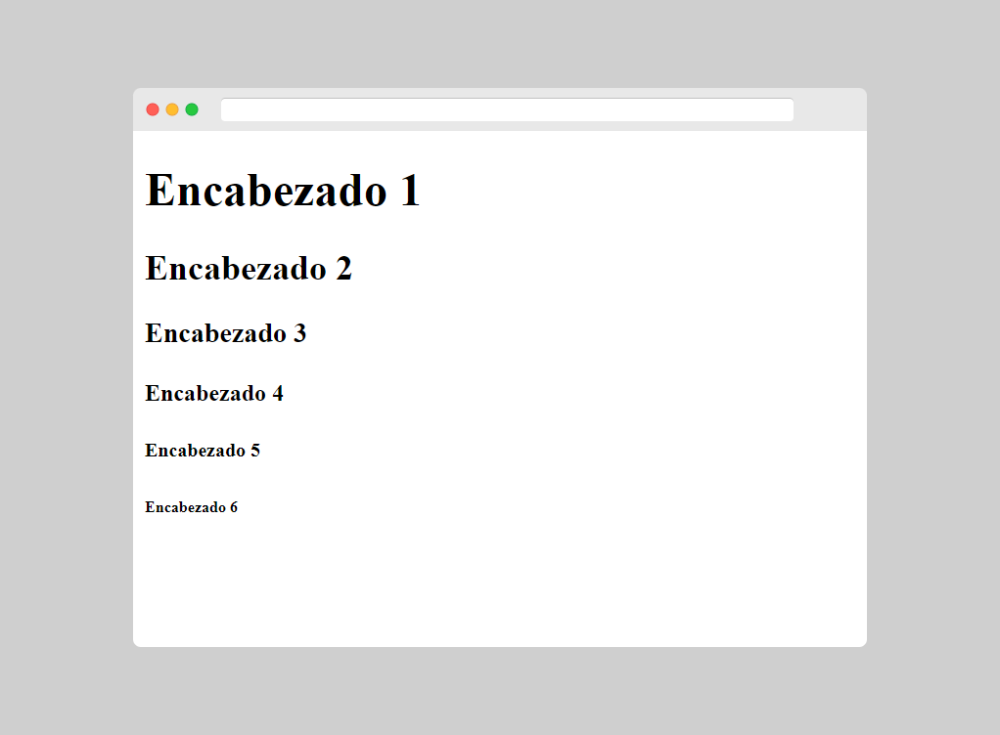
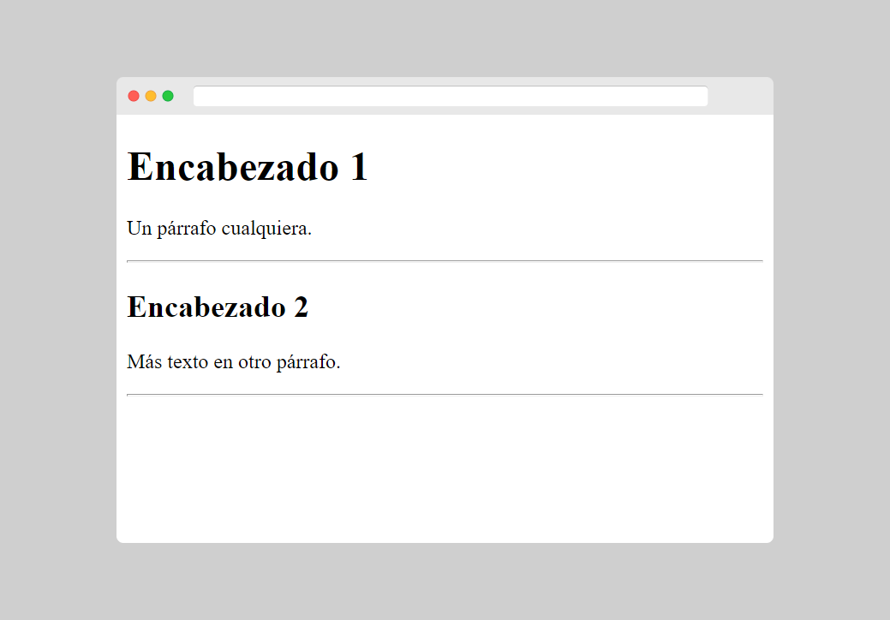

[⏴ Volver al índice](../../README.md#índice-del-curso)

# Encabezados HTML

[Ver la clase en vídeo](https://kikopalomares.com/clases/como-hacer-encabezados-en-html)

_____

Los encabezados se definen con las etiquetas `<h1>` a `<h6>`.

`<h1>` define el encabezado más importante. `<h6>` define el encabezado menos importante.

    <h1>Encabezado 1</h1>
    <h2>Encabezado 2</h2>
    <h3>Encabezado 3</h3>
    <h4>Encabezado 4</h4>
    <h5>Encabezado 5</h5>
    <h6>Encabezado 6</h6>

[Archivo del ejemplo](../../ejemplos/1.5_ejemplo_1.html)

## Los encabezados son importantes

- Los motores de búsqueda utilizan los encabezados para indexar la estructura y el contenido de sus páginas web.
- Los usuarios a menudo hojean una página por sus encabezados. Es importante utilizar encabezados para mostrar la estructura del documento.
- Los encabezados `<h1>` deben usarse para los encabezados principales, seguidos de los encabezados `<h2>`, luego los `<h3>` menos importantes, y así sucesivamente.
- Usa los encabezados HTML solo para encabezados. No los uses para hacer el texto GRANDE o negrita.

## Encabezados más grandes (o más pequeños)

Cada encabezado HTML tiene un tamaño predeterminado. Sin embargo, se puede especificar el tamaño de cualquier encabezado con el atributo style, utilizando la propiedad font-size de CSS.

## Líneas horizontales

La etiqueta `
` define una ruptura temática en una página HTML, y con mayor frecuencia se muestra como una línea horizontal.

El elemento `
` se usa para separar el contenido (o definir un cambio) en una página HTML.

    <h1>Encabezado 1</h1>
    
Un párrafo cualquiera.

    

    <h2>Encabezado 2</h2>
    
Más texto en otro párrafo.

    

[Archivo del ejemplo](../../ejemplos/1.5_ejemplo_2.html)

## El elemento HTML <head>

El elemento HTML `<head>` es un contenedor para metadatos. Los metadatos HTML son datos sobre el documento HTML. Los metadatos no se muestran.

El elemento `<head>` se coloca entre la etiqueta `<html>` y la etiqueta `<body>`.

    <!DOCTYPE html>
    <html>
    <head>
        <title>Título del documento</title>
        <meta charset="UTF-8">
    </head>
    </html>

------------
