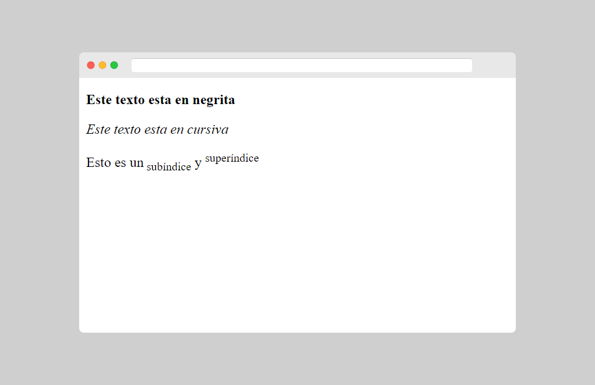
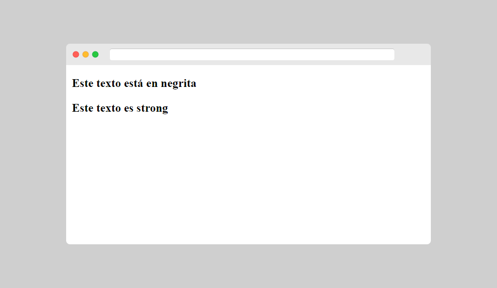
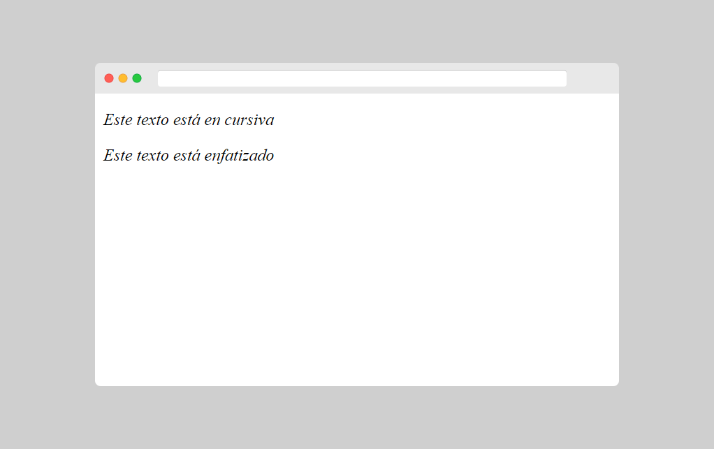
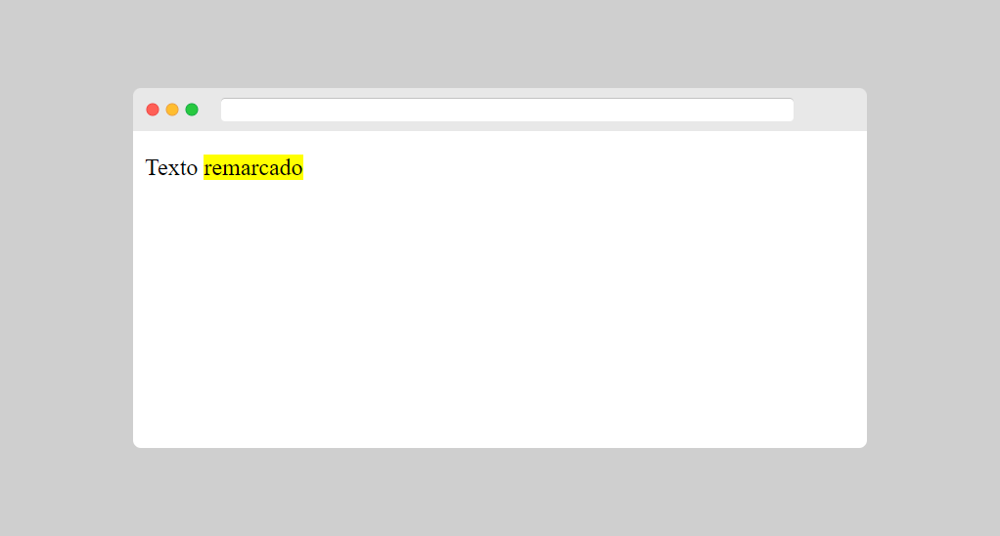
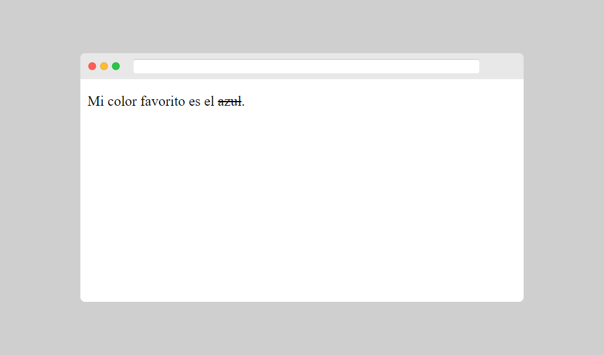
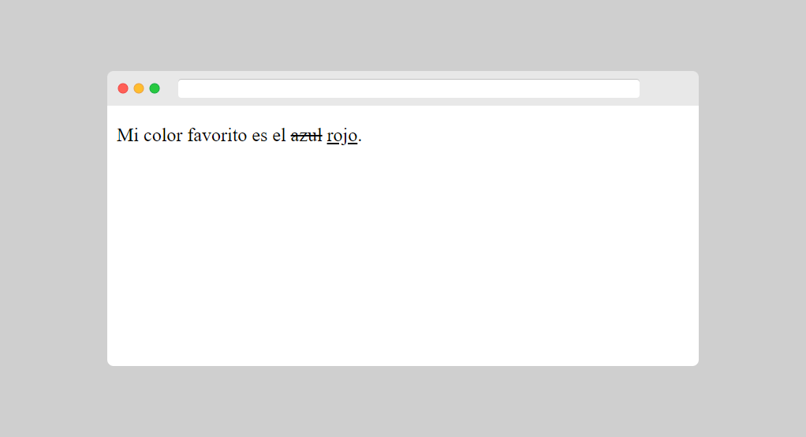
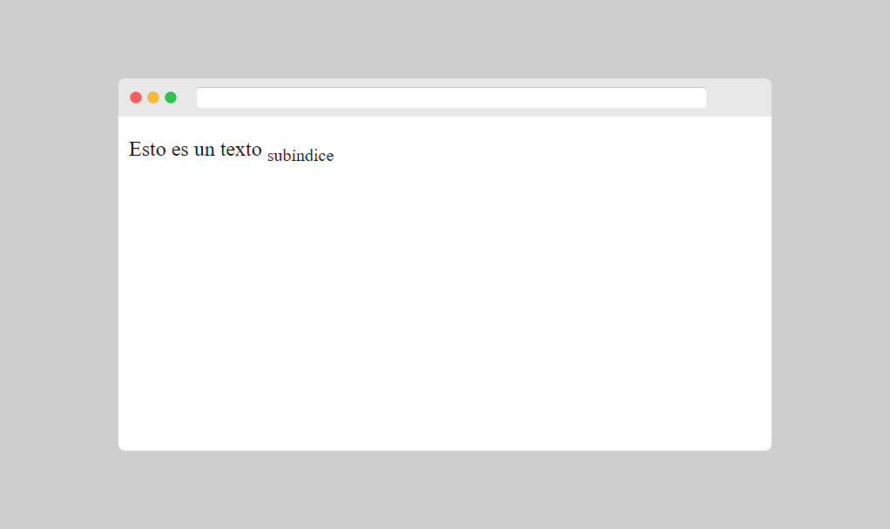
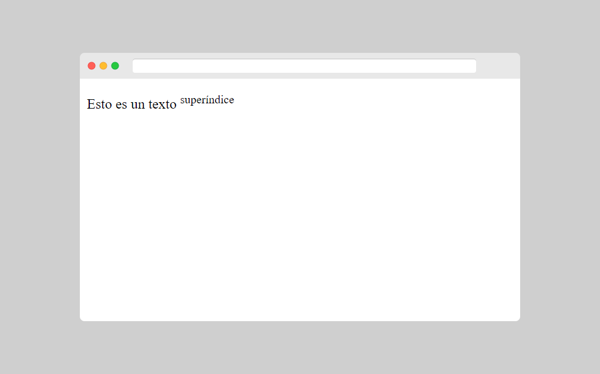

[⏴ Volver al índice](../../README.md#índice-del-curso)

# Formato de Texto

[Ver la clase en vídeo](https://kikopalomares.com/clases/las-etiquetas-para-texto-de-html-que-tienes-que-conocer)

_____

    
<b>Este texto esta en negrita</b>

    
<i>Este texto esta en cursiva</i>

    
Esto es un subíndice y superíndice

[Archivo del ejemplo](../../ejemplos/1.7_ejemplo_1.html)

## Elementos de formato HTML

Los elementos de formato fueron diseñados para mostrar tipos especiales de texto:

- `<b>` - Texto en negrita
- `<strong>` - Texto importante
- `<i>` - Texto en cursiva
- `<em>` - Texto enfatizado
- `<mark>` - Texto marcado
- `<small>` - Texto pequeño
- `<del>` - Texto eliminado
- `<ins>` - Texto insertado
- `` - Texto del subíndice
- `` - Texto superíndice

## Elementos HTML `<b>` y `<strong>`

El elemento HTML `<b>` define texto en negrita, sin ninguna importancia adicional.

El elemento HTML `<strong>` define texto fuerte, con una importancia semántica "fuerte" añadida.

    
<b>Este texto está en negrita</b>

    
<strong>Este texto es strong</strong>

[Archivo del ejemplo](../../ejemplos/1.7_ejemplo_2.html)

## Elementos HTML `<i>` y `<em>`

El elemento HTML `<i>` define el texto en cursiva, sin ninguna importancia adicional.

El elemento HTML `<em>` define texto enfatizado, con mayor importancia semántica.

    
<i>Este texto está en cursiva</i>

    
<em>Este texto está enfatizado</em>

[Archivo del ejemplo](../../ejemplos/1.7_ejemplo_3.html)

## Elemento HTML `<mark>`

El elemento HTML `<mark>` define el texto resaltado

    
Texto <mark>remarcado</mark>

[Archivo del ejemplo](../../ejemplos/1.7_ejemplo_4.html)

## Elemento HTML `<del>`

El elemento HTML `<del>` define el texto eliminado.

    
Mi color favorito es el <del>azul</del>.

[Archivo del ejemplo](../../ejemplos/1.7_ejemplo_5.html)

## Elemento HTML `<ins>`

El elemento HTML `<ins>` define el texto insertado / agregado.

    
Mi color favorito es el <del>azul</del> <ins>rojo</ins>.

[Archivo del ejemplo](../../ejemplos/1.7_ejemplo_6.html)

## Elemento HTML ``

El elemento HTML `` define el texto subíndice.

    
Esto es un texto subíndice

[Archivo del ejemplo](../../ejemplos/1.7_ejemplo_7.html)

## Elemento HTML ``
El elemento HTML `` define texto superíndice.

    
Esto es un texto superíndice

[Archivo del ejemplo](../../ejemplos/1.7_ejemplo_8.html)

------------
