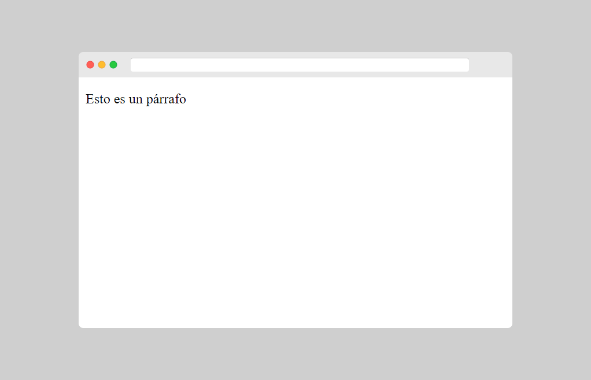

[⏴ Volver al índice](../../README.md#índice-del-curso)

# Comentarios

[Ver la clase en vídeo](https://kikopalomares.com/clases/como-agregar-comentarios-en-html)

_____

- Las etiquetas de comentarios se utilizan para insertar comentarios en el código fuente HTML.
- El navegador no muestra comentarios, pero pueden ayudarte a documentar el código HTML.
- También te puede servir para acordarte de que tienes que añadir cosas más adelante.
- Para debugar, comentar partes del código que no quieras mostrar pero tampoco quieras eliminar.

        <!-- Escribe aqui los comentarios que quieras que el navegador no los va a mostrar -->

        <!-- Ahora viene un párrafo -->
        
Esto es un párrafo

        <!-- Aqui termina el párrafo -->

        <!-- No mostramos esta imagen por ahora
        
        -->

[Archivo del ejemplo](../../ejemplos/1.8_ejemplo_1.html)

------------
