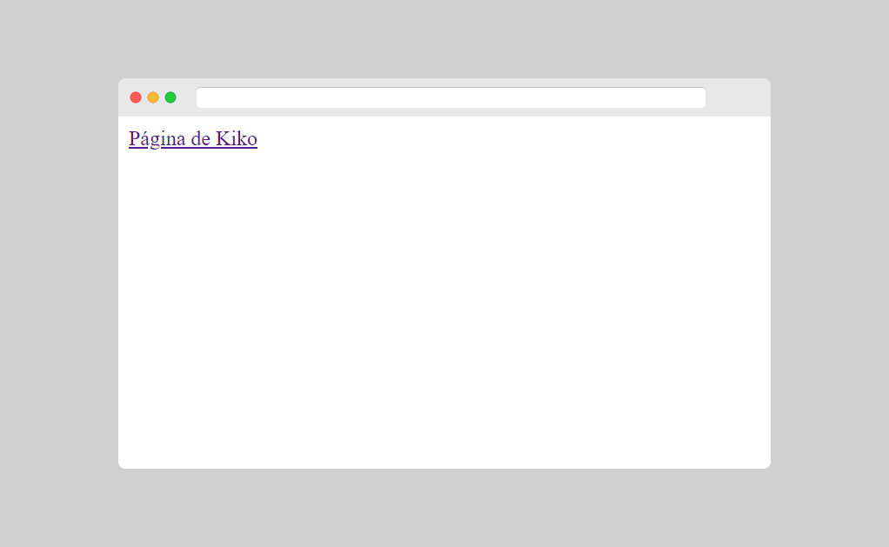
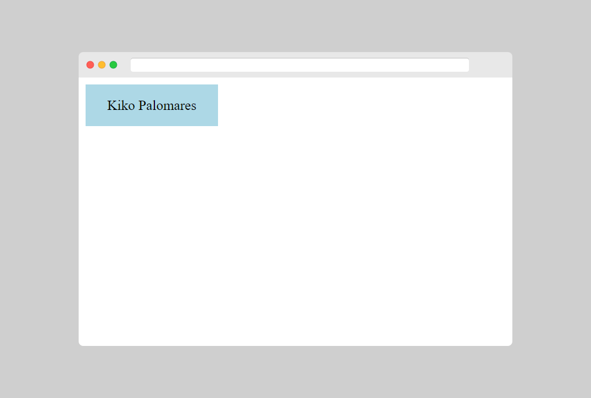

[⏴ Volver al índice](../../README.md#índice-del-curso)

# Enlaces

[Ver la clase en vídeo](https://kikopalomares.com/clases/como-crear-enlaces-en-html)

_____

Los enlaces se encuentran en casi todas las páginas web. Los enlaces permiten a los usuarios hacer clic de una página a otra.

## Enlaces HTML - Hipervínculos

- Los enlaces HTML son hipervínculos.
- Puedes hacer clic en un enlace y saltar a otro documento.
- Cuando mueves el mouse sobre un enlace, la flecha del mouse se convertirá en una pequeña mano.
- No todos los enlaces son texto, las imágenes también pueden ser enlaces

## Enlaces HTML - Sintaxis

Los hipervínculos se definen con la etiqueta `<a>`

El atributo href especifica la dirección de destino del enlace.

    <a href="https://kikopalomares.com/">Página de Kiko</a>

[Archivo del ejemplo](../../ejemplos/1.9_ejemplo_1.html)

## El atributo `target`
El atributo `target` especifica dónde abrir el documento vinculado. Puede tener uno de los siguientes valores:

- `_blank`: - Abre el documento en una nueva ventana o pestaña.
- `_self`: abre el documento vinculado en la misma ventana / pestaña en la que se hizo clic (este es el que usa por defecto).
- `_parent`: - Abre el documento vinculado en el marco primario
- `_top`: abre el documento en la ventana completa.
nombre del marco: abre el documento vinculado en un marco con nombre.

    <a href="https://kikopalomares.com" target="_blank">¡Corre a mi web!</a>

## Imágenes como enlaces

`border: 0;` se agrega para evitar que IE9 (y anteriores) muestre un borde alrededor de la imagen (cuando la imagen es un enlace).

    

## El atributo title en los enlaces

El atributo title especifica información adicional sobre un elemento. La información se muestra cuando pasamos el mouse por encima del elemento.

    <a href="https://kikopalomares.com" title="Ve a mi web!">KikoPalomares</a>

## Colores

Por defecto, los enlaces en todos los navegadores son:

- Un enlace no visitado está subrayado y azul
- Un enlace visitado está subrayado y morado
- Un enlace activo está subrayado y rojo

Se puede cambiar los colores predeterminados usando CSS.

    

    <a href="https://kikopalomares.com/">Kiko Palomares</a>

También usando CSS puedes hacer que un enlace tenga estilo de botón.

    

    <a href="https://kikopalomares/">Kiko Palomares</a>

[Archivo del ejemplo](../../ejemplos/1.9_ejemplo_2.html)

## Enlaces a marcadores

Los marcadores HTML se utilizan para saltar a partes específicas de la página web.

Pueden ser útiles si una página web es muy larga.

Cuando se hace clic en el enlace, la página se desplazará hacia abajo o hacia arriba a la ubicación con el marcador.

    
<a href="#C4">Ir al Capítulo 4</a>

    
<a href="#C10">Ir al Capítulo 10</a>

    <h2>Capítulo 1</h2>
    
En este capítulo vamos a ver...

    ...

    <h2 id="C4">Capítulo 4</h2>
    
En este capítulo vamos a ver...

    ...

    <h2 id="C10">Capítulo 10</h2>
    
En este capítulo vamos a ver...

## Resumen

`<a>` para definir un enlace
El atributo href para definir la dirección del enlace
El atributo target para definir dónde abrir el documento.
`` (dentro de `<a>`) para usar una imagen como enlace.

------------
