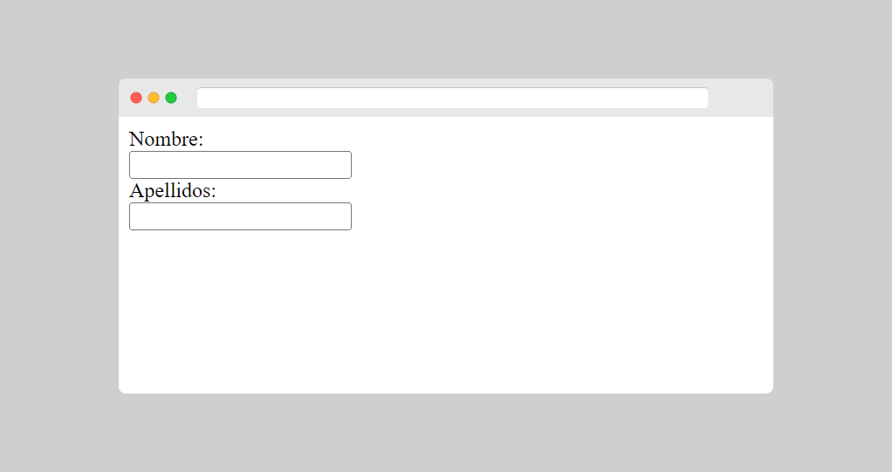
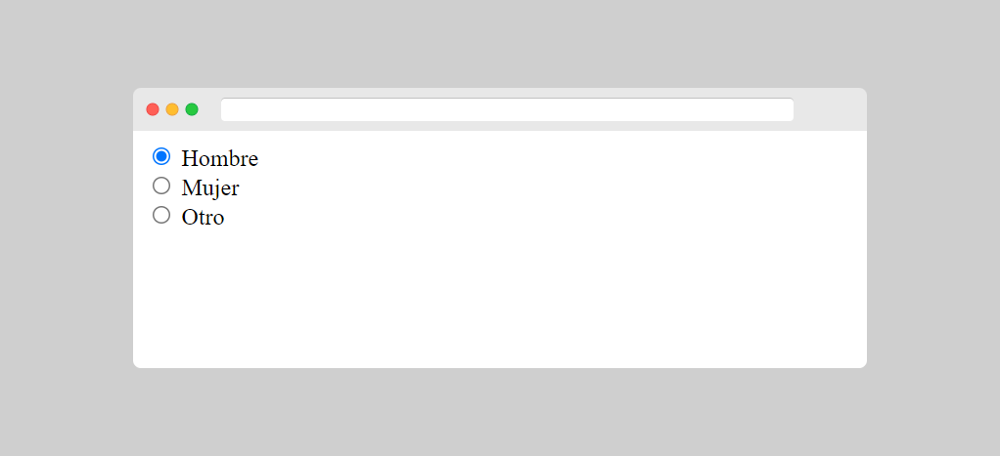
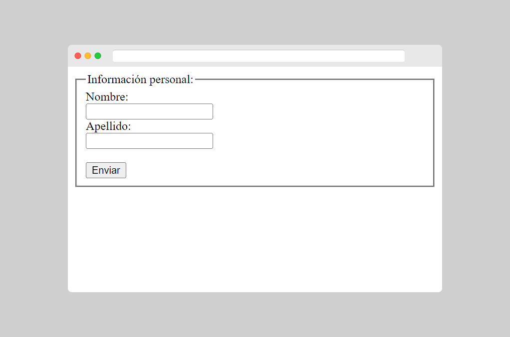

[⏴ Volver al índice](../../README.md#índice-del-curso)

# Formularios

[Ver la clase en vídeo](https://kikopalomares.com/clases/que-son-y-como-crear-formularios-en-html)

_____

## El elemento `<form>`

El elemento HTML `<form>` define un formulario que se utiliza para recopilar información por parte del del usuario

    <form>
        Nombre: 
        <input type="text" name="firstname"> 
        Apellidos: 
        <input type="text" name="lastname">
    </form>

[Archivo del ejemplo](../../ejemplos/2.1_ejemplo_1.html)

## El elemento `<input>`

El elemento `<input>` es el elemento más importante de los formularios.

El `<input>` se puede mostrar de varias maneras, según el atributo type.

| Type | Descripción |
|---|---|
| `<input type="text">` | Una línea de texto  |
| `<input type="radio">` | Un *radio button* para seleccionar varias opciones |
| `<input type="submit">` | El botón de enviar el formulario |

## Text input

El input de tipo text define un campo de texto de una sóla línea.

    <form>
        Nombre: 
        <input type="text" name="firstname"> 
        Apellidos: 
        <input type="text" name="lastname">
    </form>

## Radio button input

El type radio define un radio button. Que permite a los usuarios seleccionar UNA entre un número de opciones.

    <form>
        <input type="radio" name="gender" value="male" checked> Hombre 
        <input type="radio" name="gender" value="female"> Mujer 
        <input type="radio" name="gender" value="other"> Otro
    </form>

[Archivo del ejemplo](../../ejemplos/2.1_ejemplo_2.html)

## El botón de submit
El type submit define un botón para el envío de los datos del formulario al form-handler (el que se encarga de procesar los datos).

    <form action="/form-handler.php">
        Nombre: 
        <input type="text" name="firstname"> 
        Apellidos: 
        <input type="text" name="lastname">  
        <input type="submit" value="Enviar">
    </form>

[Archivo del ejemplo](../../ejemplos/2.1_ejemplo_3.html)

## El atributo action

El atributo action define la acción a realizar cuando se envía el formulario.

Normalmente, los datos del formulario se envían a una página web en el servidor cuando el usuario hace clic en el botón Enviar.

    <form action="/form-handler.php">

## El atributo target

El atributo target especifica si cuando se envíe el formulario el resultado se verá en una nueva pestaña del navegador, o se quedará en la actual. Por defecto el valor es `_self`.

    <form action="/form-handler.php" target="_blank">

## El atributo method

El atributo method especifica el método HTTP (GET o POST) que se va a usar cuando se envíen los datos

    <form action="/form-handler.php" method="get">

    <form action="/form-handler.php" method="post">

## ¿Cuándo usar GET?

Este es el método por defecto. Cuando se usa este método los datos serán visibles en la URL de la página de envío.

    /form-handler.php?firstname=Kiko&lastname=Palomares

- Agrega los datos del formulario a la URL en forma de nombre / valor
- La longitud de una URL es limitada (2048 caracteres)
- No se tiene que usar GET para datos confidenciales
- GET es mejor para datos no seguros, como para buscadores

## ¿Cuándo usar POST?

Siempre que haya datos confidenciales hay que usar POST. Este método no muestra la información en la URL y no tiene limitación de tamaño.

## El atributo name
Cada input debe tener un atributo name para que los datos se manden. Si no tiene los datos de ese input no se mandarán.

    <form>
        Nombre: 
        <input type="text" name="firstname"> 
        Apellidos: 
        <input type="text" name="lastname">
    </form>

## Agrupar datos con fieldset
El elemento `<fieldset>` se usa para agrupar datos relacionados en un formulario.

El elemento `<legend>` define el título del `<fieldset>`

    <form action="/form-handler.php">
        <fieldset>
            <legend>Información personal:</legend>
            Nombre: 
            <input type="text" name="firstname"> 
            Apellido: 
            <input type="text" name="lastname">  
            <input type="submit" value="Enviar">
        </fieldset>
    </form>

[Archivo del ejemplo](../../ejemplos/2.1_ejemplo_4.html)

## Lista de atributos del `<form>`

| Atributo | Descripción |
|------|-----------|
| `accept-charset` | Especifica el charset de los datos enviados |
| `action` | Especifica la URL a dónde se enviará el autocompletado |
| `autocomplete` | Define si el navegador debería mostrar el autocompletado |
| `enctype` | Especifica la codificación de los datos |
| `method` | Define el protocolo HTTP para enviar datos |
| `name` | Define el nombre para identificar el formulario |
| `novalidate` | Especifica si el navegador tiene que validar el formulario |
| `target` | Define dónde se tiene que abrir la URL de destino |

------------
