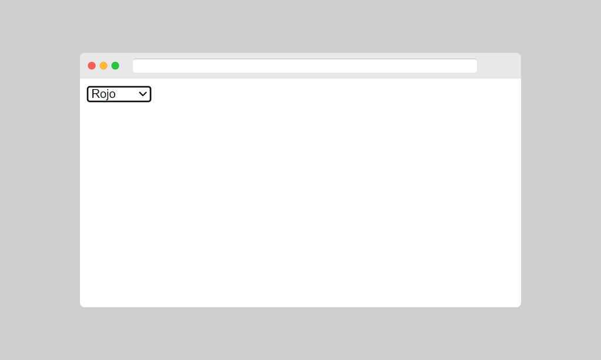
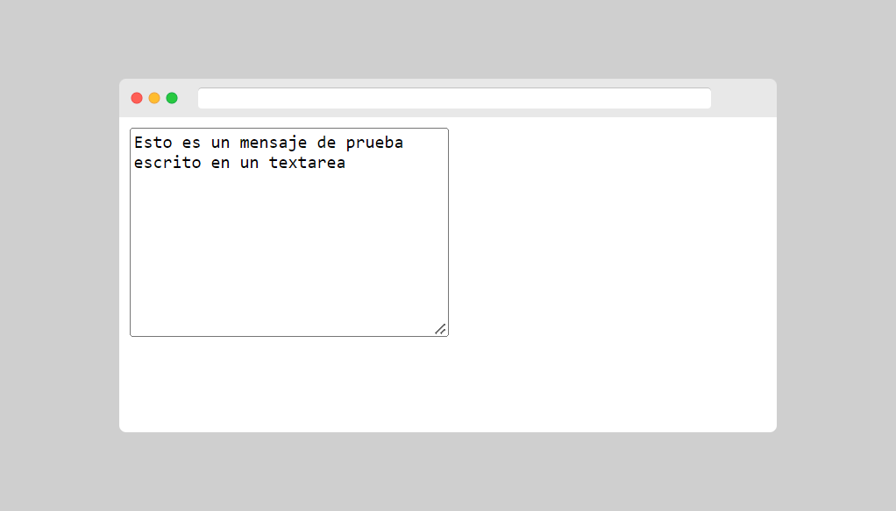
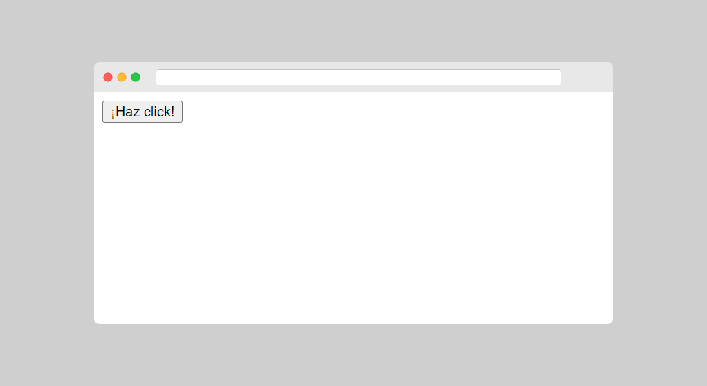
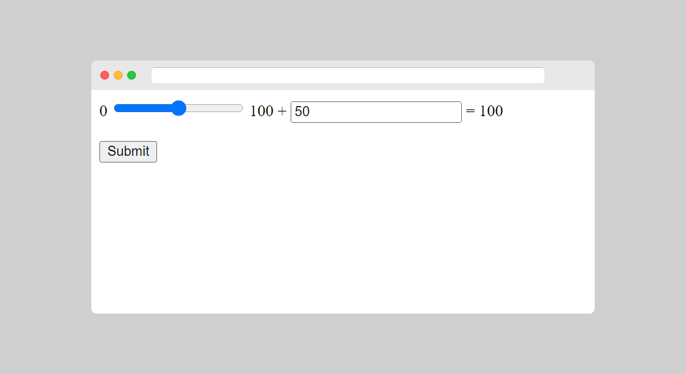

[⏴ Volver al índice](../../README.md#índice-del-curso)

# Elementos de formularios

[Ver la clase en vídeo](https://kikopalomares.com/clases/todos-los-elementos-de-formularios-en-html)

_____

## El elemento `<input>`

El elemento `<input>` es el más importante y según el type puede ser visualizado de diferentes maneras.

    <input type="text" name="name"/>

## El elemento `<select>`

El elemento `<select>` define una lista seleccionable.

    <select name="colores">
        <option value="rojo">Rojo</option>
        <option value="azuk">Azul</option>
        <option value="amarillo">Amarillo</option>
        <option value="negro">Negro</option>
    </select>

[Archivo del ejemplo](../../ejemplos/2.2_ejemplo_1.html)

El elemento `<option>` define los elementos dentro del `<select>`

Por defecto se selecciona la primera opción, podemos usar el atributo selected para cambiar eso.

    <select name="colores">
        <option value="rojo">Rojo</option>
        <option value="azul">Azul</option>
        <option value="amarillo" selected>Amarillo</option>
        <option value="negro">Negro</option>
    </select>

El atributo size especifica el número de opciones visibles.

    <select name="colores" size="3">
        <option value="rojo">Rojo</option>
        <option value="azul">Azul</option>
        <option value="amarillo">Amarillo</option>
        <option value="negro">Negro</option>
    </select>

El atributo múltiple nos permite seleccionar más de una opción

    <select name="colores" multiple>
        <option value="rojo">Rojo</option>
        <option value="azul">Azul</option>
        <option value="amarillo">Amarillo</option>
        <option value="negro">Negro</option>
    </select>

## El elemento `<textarea>`

Con el `<textarea>` tenemos un campo en el que podemos escribir varias líneas de texto.

El atributo rows especifica el número visible de líneas en un área de texto.

El atributo cols especifica el ancho visible de un área de texto.

También se puede usar el width y el height de CSS para definir el tamaño del textarea.

    <textarea name="message" rows="10" cols="30">
        Esto es un mensaje de prueba escrito en un textarea
    </textarea>

[Archivo del ejemplo](../../ejemplos/2.2_ejemplo_2.html)

## El elemento `<button>`

El elemento `<button>` define un botón clicable.

Es importante definir siempre el type, porque es posible que los navegadores tengan comportamientos diferentes.

    <button type="button" onclick="alert('¡Hola programador!')">¡Haz click!</button>

[Archivo del ejemplo](../../ejemplos/2.2_ejemplo_3.html)

## Elementos de formularios de HTML5

HTML5 añade dos nuevos elementos a los formularios:

- `<datalist>`
- `<output>`
  
Si el navegador no soporta HTML5 y no reconoce los elementos no va a “romper” la web, simplemente no los muestra.

## El elemento `<datalist>`

El elemento `<datalist>` especifica una lista predefinida para un elemento `<input>`.

    <form action="/action_page.php">
        <input list="browsers">
        <datalist id="browsers">
            <option value="Internet Explorer">
            <option value="Firefox">
            <option value="Chrome">
            <option value="Opera">
            <option value="Safari">
        </datalist>
    </form>

## El elemento `<output>`

El elemento `<output>` especifica el resultado de un cálculo.

    <form action="/action_page.php" oninput="x.value=parseInt(a.value)+parseInt(b.value)">
        0
        <input type="range"  id="a" name="a" value="50">
        100 +
        <input type="number" id="b" name="b" value="50">
        =
        <output name="x" for="a b"></output>
          
        <input type="submit">
    </form>

[Archivo del ejemplo](../../ejemplos/2.2_ejemplo_4.html)

------------
