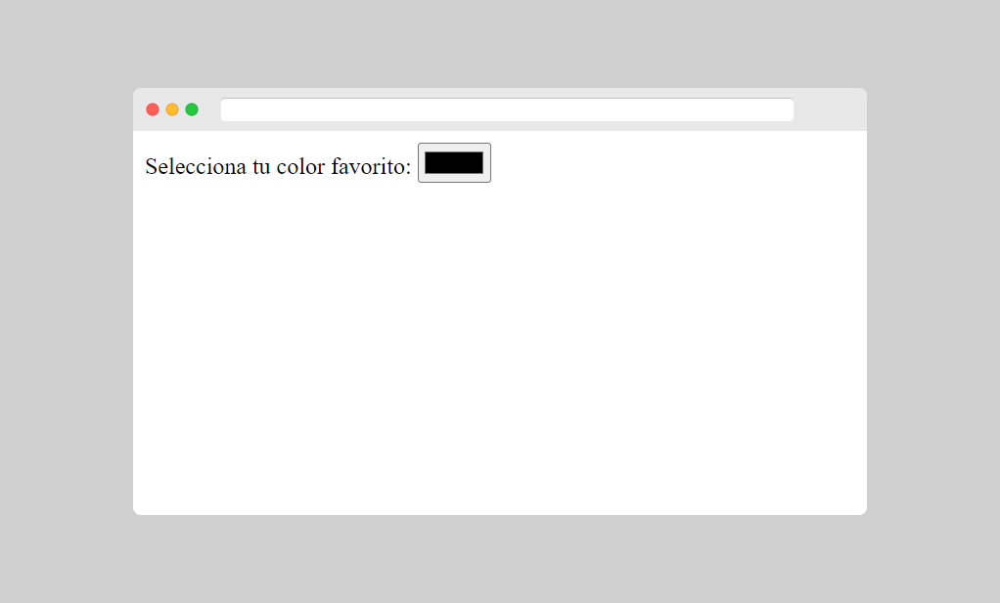
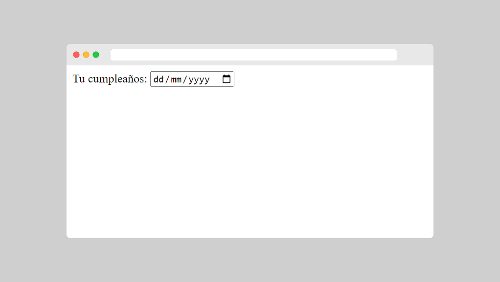
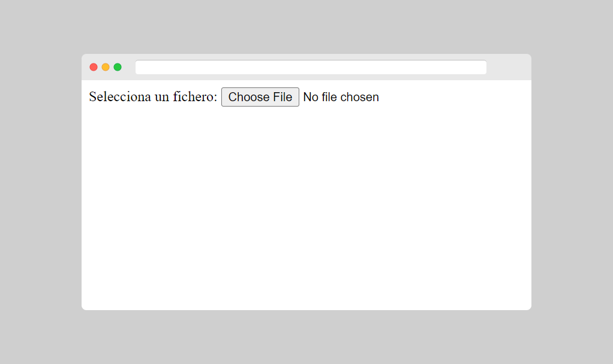

[⏴ Volver al índice](../../README.md#índice-del-curso)

# Tipos de input

[Ver la clase en vídeo](https://kikopalomares.com/clases/todos-los-tipos-de-input-para-formularios-en-html)

_____

## Input type text

Define un campo de una sola línea de texto.

    <form>
        Nombre: 
        <input type="text" name="firstname"> 
        Apellidos: 
        <input type="text" name="lastname">
    </form>

## Input type password

Define un campo para contraseñas.

    <form>
        Nombre de usuario: 
        <input type="text" name="username"> 
        Contraseña: 
        <input type="password" name="psw">
    </form>

## Input type submit

Define un botón para enviar los datos del formulario.

    <form action="/action_page.php">
        Nombre: 
        <input type="text" name="firstname"> 
        Apellidos: 
        <input type="text" name="lastname">  
        <input type="submit" value="Enviar">
    </form>

## Input type reset

Define un botón para resetear todos los valores del formulario a los valores por defecto.

    <form action="/action_page.php">
    Nombre: 
        <input type="text" name="firstname"> 
        Apellidos: 
        <input type="text" name="lastname">  
        <input type="submit" value="Enviar">
        <input type="reset">
    </form>

## Input type radio

Define un radio button, que te permite seleccionar UNA opción entre varias.

    <form>
        <input type="radio" name="gender" value="male" checked> Hombre 
        <input type="radio" name="gender" value="female"> Mujer 
        <input type="radio" name="gender" value="other"> Otro
    </form>

[Archivo del ejemplo](../../ejemplos/2.3_ejemplo_1.html)

## Input type checkbox

Define un checkbox. Nos permite seleccionar ninguna o varias opciones.

    <form>
        <input type="checkbox" name="vehicle1" value="Bike"> Tengo una bicicleta 
        <input type="checkbox" name="vehicle2" value="Car"> Tengo un coche
    </form>

[Archivo del ejemplo](../../ejemplos/2.3_ejemplo_2.html)

## Input type button

Define un botón.

    <input type="button" onclick="alert('¡Hola programador!')" value="¡Haz click!">

## HTML5 input types
En HTML5 se añadieron varios tipos nuevos:

- `color`
- `date`
- `datetime-local`
- `email`
- `month`
- `number`
- `range`
- `search`
- `tel`
- `time`
- `url`
- `week`

## Input type color

    <form>
        Selecciona tu color favorito:
        <input type="color" name="favcolor">
    </form>

[Archivo del ejemplo](../../ejemplos/2.3_ejemplo_3.html)

## Input type date

Se usa para seleccionar fechas.

    <form>
        Tu cumpleaños:
        <input type="date" name="birthday">
    </form>

[Archivo del ejemplo](../../ejemplos/2.3_ejemplo_4.html)

Se puede añadir los atributos min y max para restringir la selección.

    <form>
        Fecha antes del 1980-01-01:
        <input type="date" name="bday" max="1979-12-31"> 
        Fecha después del 2000-01-01:
        <input type="date" name="bday" min="2000-01-02"> 
    </form>

## Input type datetime-local

Se usa para una fecha y hora sin tener en cuenta la zona horaria.

    <form>
        ¿Cuando te registraste? (fecha y hora):
        <input type="datetime-local" name="daytime">
    </form>

## Input type email

Para contener direcciones de correo electrónico.

    <form>
        Correo electrónico:
        <input type="email" name="email">
    </form>

## Input type file

Define un campo para subir ficheros

    <form>
        Selecciona un fichero: <input type="file" name="myFile">
    </form>

[Archivo del ejemplo](../../ejemplos/2.3_ejemplo_5.html)

## Input type month

Permite seleccionar mes y año.

    <form>
        Mes y año:
        <input type="month" name="monthYear">
    </form>

## Input type number

Sirve para valores numéricos. Se puede restringir los números aceptados usando algunos atributos.

    <form>
        Cantidad (entre 1 y 5):
        <input type="number" name="quantity" min="1" max="5">
    </form>

## Restricciones de los inputs

- `checked`: Especifica si un input de tipo checkbox o radio tiene que estar seleccionado por defecto.
- `disabled`: Especifica si un input debería estar deshabilitado.
- `max`: Especifica el máximo del valor de un input.
- `maxlength`: Especifica el número máximo de caracteres.
- `min`: Especifica el valor mínimo del input.
- `pattern`: Especifica una expresión regular para chequear el valor del input.
- `readonly`: Especifica si el input no se puede cambiar.
- `required`: Especifica si el input es obligatorio de rellenar.
- `size`: Especifica el ancho (en caracteres) para el input.
- `step`: Especifica el intervalo para pasar de un valor numérico a otro.
- `value`: Especifica el valor por defecto del input.

        <form>
            Cantidad:
            <input type="number" name="points" min="0" max="100" step="10" value="30">
        </form>

## Input type range

Proporciona un slider para seleccionar un valor numérico entre dos valores (por defecto de 0 a 100).

    <form>
        <input type="range" name="points" min="0" max="10">
    </form>

[Archivo del ejemplo](../../ejemplos/2.3_ejemplo_6.html)

## Input type search

Se usa para buscadores (se comporta como un input text).

    <form>
        Busca en Google:
        <input type="search" name="googlesearch">
    </form>

## Input type tel

Se usa para números de teléfono

    <form>
        Teléfono:
        <input type="tel" name="phone" pattern="[0-9]{3}-[0-9]{2}-[0-9]{3}">
    </form>

## Input type time

Permite seleccionar una hora (sin tener en cuenta la zona horaria).

    <form>
        Selecciona la hora:
        <input type="time" name="usr_time">
    </form>

## Input type url

Se usa para rellenar el input con una URL

    <form>
        Añade tu página web:
        <input type="url" name="homepage">
    </form>

## Input type week

Se usa para seleccionar la semana y el año.

    <form>
        Selecciona la semana:
        <input type="week" name="week_year">
    </form>

------------
